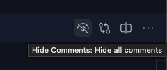

<p align="center">
  <a href="https://marketplace.visualstudio.com/items?itemName=eliostruyf.vscode-hide-comments">
    
  </a>
</p>

<h1 align="center">Hide Comments - VSCode Extension</h1>

<p align="center">
  <a href="https://marketplace.visualstudio.com/items?itemName=eliostruyf.vscode-hide-comments" title="Check it out on the Visual Studio Marketplace">
    
  </a>

  
  
  

  <a href="https://www.buymeacoffee.com/zMeFRy9" title="Buy me a coffee" style="margin-left:10px">
    
  </a>
</p>

This extension started as a joke for people who do not like to see comments in the code. The extension will set all comments to **transparent**. The extension will never remove the comments from the file.

> **Important**: Although it might have been started as a joke. There might be people out there that would actually like to hide the comments in their projects. That is why I will keep this project alive.

## Usage

When the extension is installed. You can use the `Hide Comments` commands to show or hide the comments.

If you want, you can also let the extension ask you each time when you start a new instance if you want to hide the comments. You can do this by enabling the `hideComments.defaultEnabled` setting. When this is set to `true`, you will get the following notification when you start a new instance:


When you choose **Yes** it will at the settings to your user settings for this project. If you decide **No**, nothing will happen at all.

## Menu editor title actions

On the editor title, a toggle action is available to show/hide the comments quickly.



> Note: In case you are using the `hideComments.regex` setting to hide additional lines with custom regex, you will have a second toggle action available.

## Settings

- `hideComments.defaultEnabled`: Define if you want to enable or disable the extension on startup of Visual Studio Code. Default: `false`.
- `hideComments.cleanStart`: Define if you want to start each instance by showing the comments in your files. Default: `true`.
- `hideComments.regex`: Specify the regular expression to use to hide additional lines. Default: `null`.

## Commands

The extension currently has the following commands:

1. `Hide Comments: Hide all comments`
2. `Hide Comments: Show all comments`
3. `Hide Comments: Show lines by regex`: this command is only available when the `hideComments.regex` setting is set.
4. `Hide Comments: hide lines by regex`: this command is only available when the `hideComments.regex` setting is set.

## Hide additional lines by regex

In case you want to hide additional lines with a custom regex, you can use the `hideComments.regex` setting. Here is an example:

```json
{
  "hideComments.regex": [
    {
      "regex": "console\\.log\\(([^)]+)\\).*",
      "flags": "igm"
    }
  ]
}
```

## Removing the extension

When you want to remove the extension, but still have the comments hidden. It is best to first run the `Hide Comments: Show all comments` command. This will make sure that all settings will be reset.

If you did already uninstall the extension, but still your comments are hidden. Here is what you can do:

- Open your workspace settings via: `Preferences: Open Workspace Settings (JSON)`
- Remove the following code from the JSON file:

```
"editor.tokenColorCustomizations": {
  ...
}
```

## Feedback / issues / ideas

Please submit them via creating an issue in the project repository: [issue list](https://github.com/estruyf/vscode-hide-comments/issues).

<p align="center">
  <a href="#">
      
   </a>
</p>