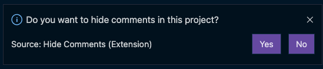

# VSCode Hide Comments Extension

<p align="center">
  <a href="https://marketplace.visualstudio.com/items?itemName=eliostruyf.vscode-hide-comments">
    
  </a>
</p>

This extension started as a joke for people who do not like to see comments in the code. The extension will set all comments to **transparent**. The extension will never remove the comments from the file.

> **Important**: Although it might have been started as a joke. There might be people out there that would actually like to hide the comments in their projects. That is why I will keep this project alive.

## Usage

When you have installed this extension, each time you open VSCode, it checks if comments are shown or not. If comments are visible, it will ask you if you want to hide these for the current project.



When you choose **Yes** it will at the settings to your user settings for this project. If you decide **No**, nothing will happen at all.

## Commands

The extension currently has two commands:

1. `Hide Comments: Hide all comments`
2. `Hide Comments: Show all comments`


## Removing the extension

When you want to remove the extension, but still have the comments hidden. It is best to first run the `Hide Comments: Show all comments` command. This will make sure that all settings will be reset.

If you did already uninstall the extension, but still your comments are hidden. Here is what you can do:

- Open your workspace settings via: `Preferences: Open Workspace Settings (JSON)`
- Remove the following code from the JSON file:

```
"editor.tokenColorCustomizations": {
  ...
}
```

## Feedback / issues / ideas

Please submit them via creating an issue in the project repository: [issue list](https://github.com/estruyf/vscode-hide-comments/issues).